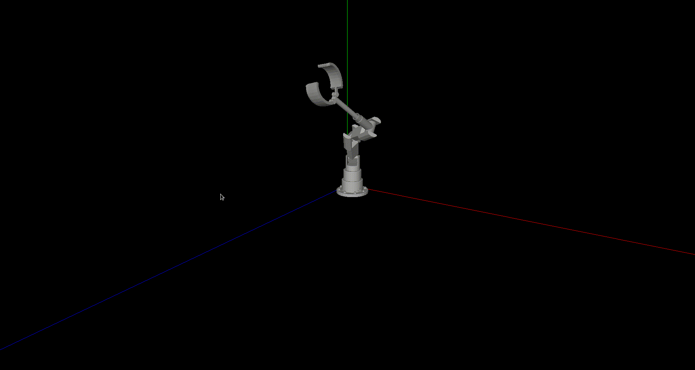
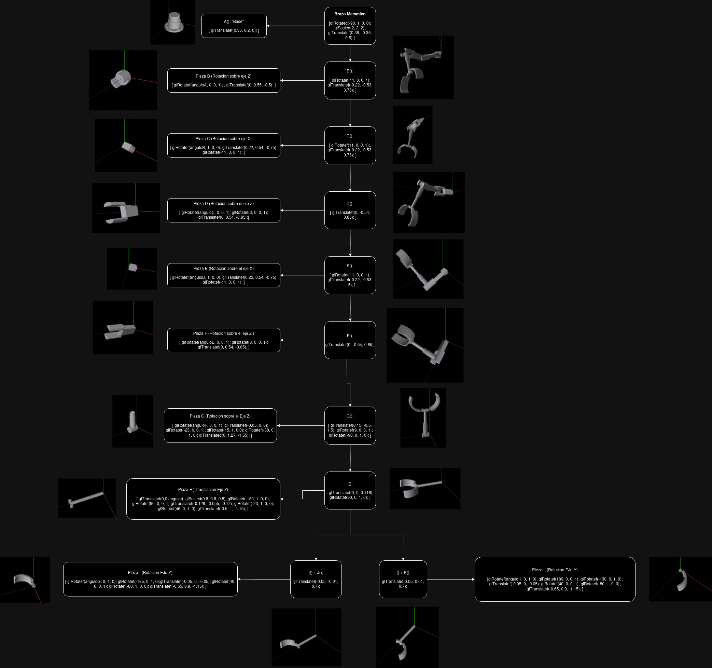

# Practica 3

- Brazo mecanico de 9 articulaciones
- hacer un `make total`
- Entrar en la Escena 3 presionando 3
- Usar las letras q,w,e,r,t,y,u,a para mover el brazo mecanico. En mayuscula en sentido horario y en minuscula antihorario.
- Para la animacion pular la letra s

## Animacion

## Grafo de Escena

