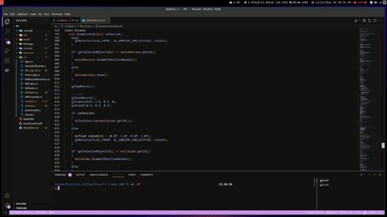

# Práctica 5: Interacción

## Qué he hecho

- hacer un `make total` para ejecutar limpio el proyecto 

- En el escenario 5 puedo seleccionar la manzana, el cubo, la taza o el lobo con el boton de en medio, si esta seleccionado, pinta los bordes en amarillo para saber que esta seleccionado, si vuelve a seleccionar dicho objeto lo deseleccionas.

- He implementado lo de las textura de lobo

