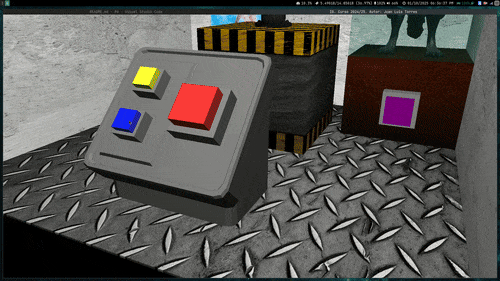

## Práctica 6 Final: Laboratorio
Elementos Implementados

He diseñado dos escenas distintas que incluyen diversas funcionalidades y animaciones:
Primera Escena: Interacción con una Máquina Analizadora

1. Selección Interactiva
        Se implementó un sistema de botones interactivos, cada uno con animaciones propias. Además, se añadieron elementos translúcidos como complemento visual en los materiales.

2. Control de Iluminación
        Desde el panel de control, el botón amarillo permite encender y apagar las luces de forma dinámica.

3. Primera Escena: Análisis de la Manzana
    En la primera escena, una máquina analiza una manzana mediante el panel de control. Con el botón rojo se puede experimentar con diferentes visualizaciones y texturas:
        - Dibujado Flat: Representación plana de la superficie.
        - Dibujado Smooth: Representación suave de las formas.
        - Manzana de Oro: Aplicación de textura dorada.
        - Visión en Líneas: Representación de líneas del modelo.
        - Textura de Madera: Texturizado con coordenadas cilíndricas.
        - Textura de Mármol: Texturizado automático lineal de OpenGL.
        - Transformación a Dado: Convierte la manzana en un dado.

4. Cambio de Escena
        El botón azul en el panel de control permite avanzar a la segunda escena.

5. Segunda Escena: Brazo Mecánico y Hombre Lobo

- Brazo Mecánico
    - Con el botón rojo se activa una animación predeterminada del brazo mecánico. Además, es posible controlar manualmente sus 9 ejes mediante el teclado:
        - Teclas: q, w, e, r, t, y, u, a (esta última mueve 2 ejes simultáneamente).
        - Uso de mayúsculas para mover en una dirección y minúsculas para la dirección opuesta.

- Hombre Lobo y Efectos Especiales
    - El escenario incluye un estante con un modelo de un hombre lobo que tiene una textura personalizada.
    - Como detalle adicional, al presionar el botón morado ubicado en el estante, se activa un efecto especial de "discoteca".
  
## Ejemplo de Animación

